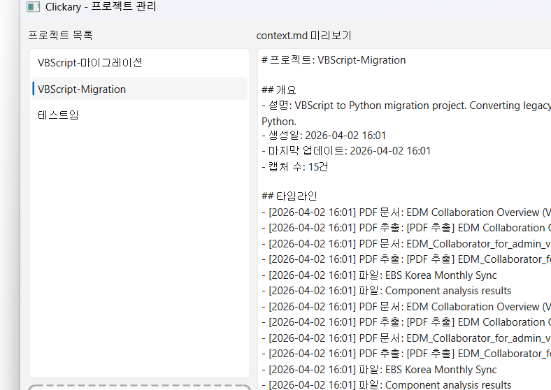
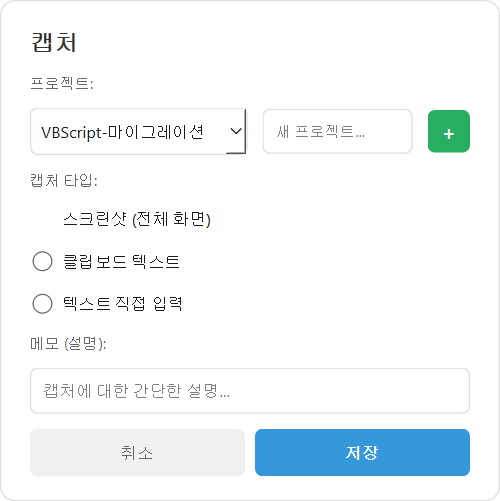
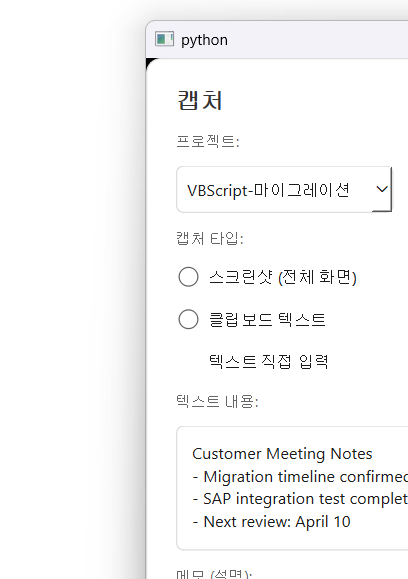
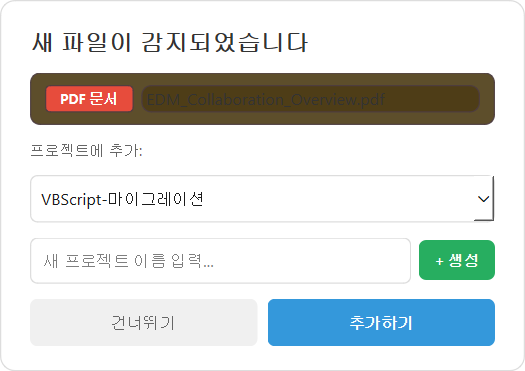
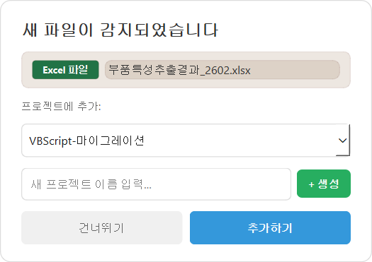
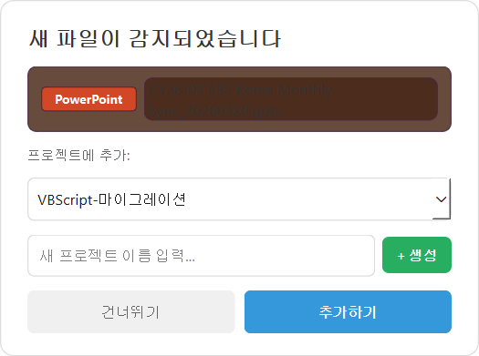

# Clickary

> 딸깍 한 번에, 프로젝트는 기억된다.

단축키 한 번으로 화면/파일/텍스트를 프로젝트별로 자동 저장하고, AI가 바로 이해할 수 있는 Markdown 인수인계 문서를 자동 생성하는 데스크톱 도구.

---

## 왜 만들었나?

- 프로젝트 데이터가 이메일, 슬랙, 로컬 폴더에 **산재**
- 담당자 바뀌면 "이거 어디 있어요?" 반복
- AI 활용하려면 자료 찾기 → 복붙 → 맥락 설명에 시간 낭비
- **AI 쓰는 시간보다 AI한테 줄 자료 정리하는 시간이 더 길다**

## 핵심 기능

| 기능 | 설명 |
|------|------|
| 원클릭 캡처 | `Win+Shift+A` → 프로젝트 선택 → 2초 만에 저장 |
| Downloads 자동 감지 | 파일 다운로드하면 즉시 팝업 → 프로젝트에 추가 |
| 드래그앤드롭 | 프로젝트 윈도우에 파일 끌어다 놓기 |
| 우클릭 보내기 | 파일 우클릭 → 보내기 → Clickary |
| PDF 텍스트 추출 | PDF 내용을 자동으로 읽어서 MD에 포함 |
| AI 최적화 문서 | `context.md` 자동 생성 → LLM에 바로 전달 |
| 100% 로컬 저장 | 데이터가 외부로 나가지 않음 |
| 부팅 시 자동 시작 | 시작프로그램 자동 등록, 트레이에서 백그라운드 실행 |

---

## 사용 흐름

```
작업 중 중요한 화면/파일 발견
  → Win+Shift+A (또는 Downloads에 파일 저장)
  → 프로젝트 선택 (없으면 바로 생성)
  → 자동 저장 + context.md 업데이트
  → AI에게 context.md 전달하면 끝!
```

---

## 화면 안내

### 프로젝트 관리 윈도우

왼쪽에서 프로젝트를 선택하면 오른쪽에 AI용 `context.md` 미리보기가 표시됩니다.
파일을 끌어다 놓으면 선택된 프로젝트에 자동 추가됩니다.



### 캡처 다이얼로그 (`Win+Shift+A`)

스크린샷, 클립보드 텍스트, 텍스트 직접 입력 중 선택할 수 있습니다.
프로젝트가 없으면 바로 생성할 수 있습니다.



### 텍스트 직접 입력

"텍스트 직접 입력"을 선택하면 여러 줄 입력 영역이 나타납니다.
회의록, 메모, 코드 스니펫 등을 바로 저장할 수 있습니다.



### Downloads 자동 감지 팝업

파일을 다운로드하면 반투명 오버레이와 함께 팝업이 표시됩니다.
파일 타입이 자동 인식되고, 프로젝트를 선택하거나 새로 만들 수 있습니다.



다양한 파일 타입을 자동 인식합니다:

<p>

&nbsp;&nbsp;

</p>

---

## 설치

```bash
# 1. 클론
git clone https://github.com/minjuyang56/clickary.git
cd clickary

# 2. 가상환경 생성
python -m venv venv
venv\Scripts\activate

# 3. 의존성 설치
pip install -r requirements.txt

# 4. 실행
python -m src.main
```

첫 실행 시 자동으로:
- Windows **시작프로그램에 등록** (부팅 시 자동 실행)
- **우클릭 → 보내기 → Clickary** 메뉴 추가
- **Downloads 폴더 감시** 시작

## 사용법

### 기본 사용

| 동작 | 방법 |
|------|------|
| 캡처 다이얼로그 열기 | `Win+Shift+A` |
| 프로젝트 관리 | 트레이 아이콘 **더블클릭** 또는 우클릭 → 프로젝트 관리 |
| 파일 추가 | 프로젝트 윈도우에 **드래그앤드롭** |
| 파일 추가 (탐색기) | 파일 **우클릭 → 보내기 → Clickary** |
| 앱 종료 | 트레이 아이콘 우클릭 → 종료 |

### 파일 타입별 자동 처리

| 파일 타입 | 처리 |
|-----------|------|
| PDF | 프로젝트에 복사 + **텍스트 자동 추출** → context.md에 내용 포함 |
| 이미지 (PNG/JPG) | 프로젝트 captures/에 복사 |
| 문서 (DOCX/PPTX/XLSX) | 프로젝트 captures/에 복사 |
| 텍스트 (TXT/MD/CSV) | 내용을 읽어서 notes/에 저장 |
| 기타 | 프로젝트 captures/에 복사 |

### AI용 문서 (context.md)

Clickary가 자동 생성하는 `context.md`는 이런 구조입니다:

```markdown
# 프로젝트: VBScript-Migration

## 개요
- 설명: VBScript to Python migration project
- 생성일: 2026-04-02 16:01
- 마지막 업데이트: 2026-04-02 16:51
- 캡처 수: 15건

## 타임라인
- [2026-04-02 16:01] PDF 문서: EDM Collaboration Overview
- [2026-04-02 16:01] 텍스트: Samsung SDI customer meeting notes
- ...

## 문서 내용 (PDF 추출)
### EDM Collaboration Overview
*원본: EDM Collaboration Overview (VX.2.11).pdf | 12320자 추출*
(PDF에서 추출된 전체 텍스트)

## 텍스트 노트
### Samsung SDI customer meeting notes
(저장한 텍스트 전문)

## 파일 목록
- captures/20260402_migration_plan.xlsx (원본: migration_plan.xlsx)
```

이 파일을 Claude/ChatGPT에 그대로 전달하면 프로젝트 맥락을 **즉시** 이해합니다.

---

## 프로젝트 구조

```
clickary/
├── src/
│   ├── main.py              # 앱 엔트리포인트
│   ├── capture.py           # 스크린샷/파일/텍스트/PDF 캡처
│   ├── project_manager.py   # 프로젝트 CRUD
│   ├── md_generator.py      # AI용 Markdown 문서 생성
│   ├── hotkey.py            # 글로벌 단축키 (Win+Shift+A)
│   ├── file_watcher.py      # Downloads 폴더 감시
│   ├── tray.py              # 시스템 트레이
│   ├── autostart.py         # 시작프로그램 등록
│   ├── sendto.py            # Windows 보내기 메뉴
│   └── ui/
│       ├── capture_dialog.py    # 캡처 다이얼로그
│       ├── download_popup.py    # 다운로드 감지 팝업
│       └── project_list.py      # 프로젝트 관리 윈도우
├── data/                    # 프로젝트 데이터 (자동 생성)
│   └── {프로젝트명}/
│       ├── captures/        # 스크린샷, 파일, PDF
│       ├── notes/           # 텍스트 메모, PDF 추출
│       └── context.md       # AI용 자동 생성 문서
├── tests/                   # 95개 테스트
└── docs/screenshots/        # UI 스크린샷
```

## 기술 스택

- Python 3.11+
- PyQt6 (GUI, 시스템 트레이)
- Pillow + mss (스크린샷)
- pynput (글로벌 단축키)
- PyMuPDF (PDF 텍스트 추출)
- watchdog (Downloads 감시)

## 차별점

| | 노션/Confluence | 클립보드 매니저 | Clickary |
|---|---|---|---|
| 프로젝트 분류 | 수동 정리 | 없음 | 자동 분류 |
| AI용 문서 | 없음 | 없음 | 자동 생성 |
| PDF 내용 추출 | 없음 | 없음 | 자동 추출 |
| Downloads 감지 | 없음 | 없음 | 자동 팝업 |
| 데이터 저장 | 클라우드 | 로컬 | 로컬 |
| 보안 민감 기업 | 제한적 | 가능 | 가능 |

## 라이선스

MIT
